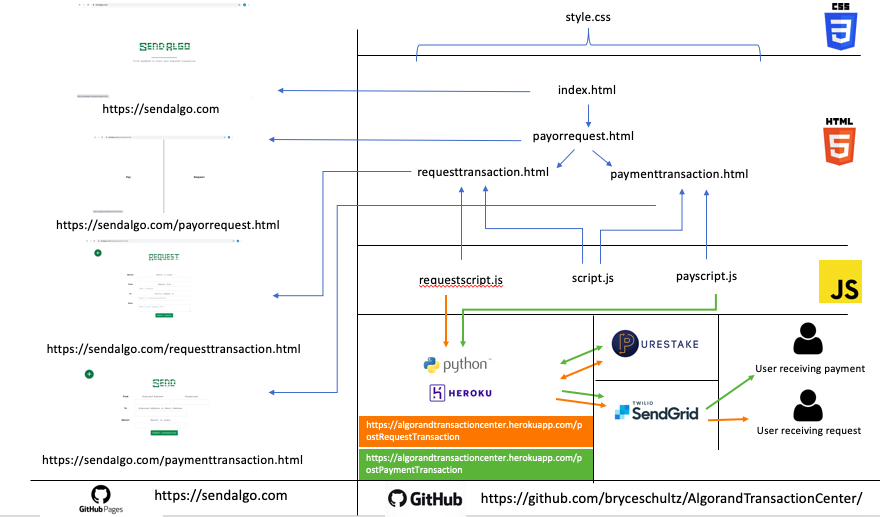

# AlgorandTransactionCenter

## Usage
To interact with the existing application you can go to https://sendalgo.com where the application is hosted via github pages.

The application attemps to make it incredibly simple for a first time user to send transactions over the Algorand TestNet.

The application can also be forked and built upon by another user wishing to develop it further using the below cmd:
````
$ git clone https://github.com/bryceschultz/AlgorandTransactionCenter
````

## Architecture


## Functionalities
The 5 main functionalities of the Algorand Transaction Center are as follows:
1. Allow a user to send a payment from their Algorand address to another users Algorand address
2. Allow a user to send a payment from their Algorand address to another users email (an Algorand address is created at the time of transaction and sent to the receiving user).
3. Allow a user to send a request for payment to another user via email.
4. Allow a user to create a wallet with a web UI
5. Guide a user through funding their wallet using a web UI

## Functionality 1. pay an exisitng Algorand address
