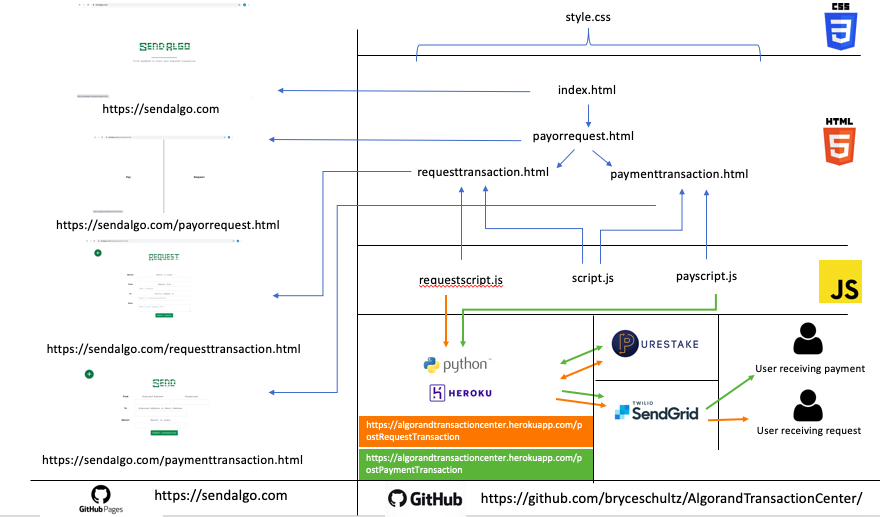
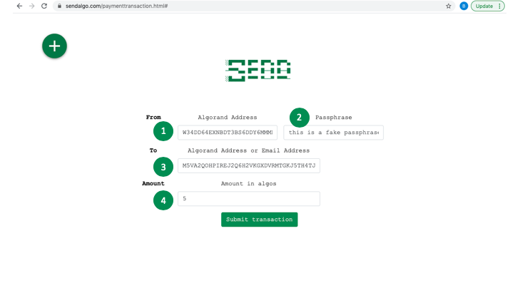
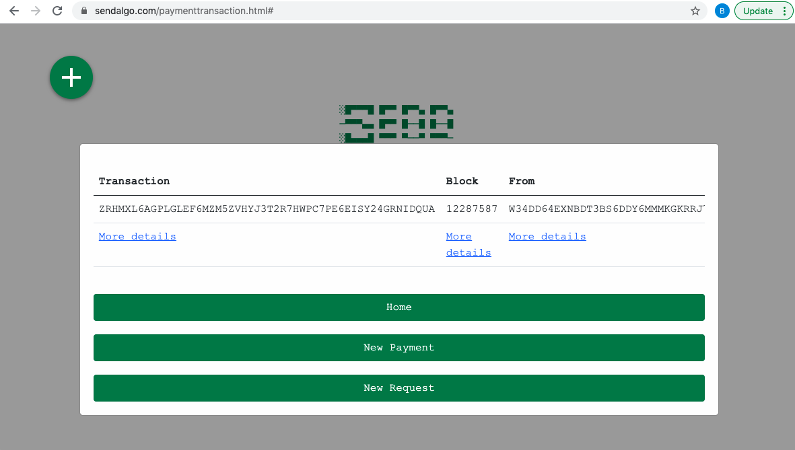
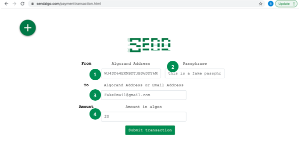

# AlgorandTransactionCenter

## Usage
To interact with the existing application you can go to https://sendalgo.com where the application is hosted via github pages.

The application attemps to make it incredibly simple for a first time user to send transactions over the Algorand TestNet.

The application can also be forked and built upon by another user wishing to develop it further using the below cmd:
````
$ git clone https://github.com/bryceschultz/AlgorandTransactionCenter
````

## Architecture


## Functionalities
The 5 main functionalities of the Algorand Transaction Center are as follows:
1. Allow a user to send a payment from their Algorand address to another users Algorand address
2. Allow a user to send a payment from their Algorand address to another users email (an Algorand address is created at the time of transaction and sent to the receiving user).
3. Allow a user to send a request for payment to another user via email.
4. Allow a user to create a wallet with a web UI
5. Guide a user through funding their wallet using a web UI

## Functionality 1. pay an existing Algorand address
1. From the home page (https://sendalgo.com) click anywhere
2. Now click on the 'Pay' side of the page
3. Fill out the payment transaction form:
    -a. Enter your algorand address in the first box.
    -b. Enter your algorand passphrase in the second box.
    -c. Enter another users algorand address you wish to send the algos to in the third box.
  d. Enter the amount of algos you want to send in the fourth box.
  
4. Hit enter
  a. If your transaction is successful you will see the below message:
  

## Functionality 2. pay an Email
1. From the home page (https://sendalgo.com) click anywhere
2. Now click on the 'Pay' side of the page
3. Fill out the payment transaction form:
+Enter your algorand address in the first box.
+Enter your algorand passphrase in the second box.
+Enter another users email address you wish to send the algos to in the third box.
+Enter the amount of algos you want to send in the fourth box.

4. Hit enter
  +a. If your transaction is successful you will see the below message:
  +
  
  ## Functionality 3. request a user to pay you
1. From the home page (https://sendalgo.com) click anywhere
2. Now click on the 'Request' side of the page
3. Fill out the request transaction form:
  +a. Enter your algorand address in the first box.
  +b. Enter your algorand passphrase in the second box.
  +c. Enter another users email address you wish to send the algos to in the third box.
  +d. Enter the amount of algos you want to send in the fourth box.
  +
4. Hit enter
  +a. If your transaction is successful you will see the below message:
  +
  
  ## Functionality 3. creating a wallet
  
  ## Functionality 3. funding a wallet
